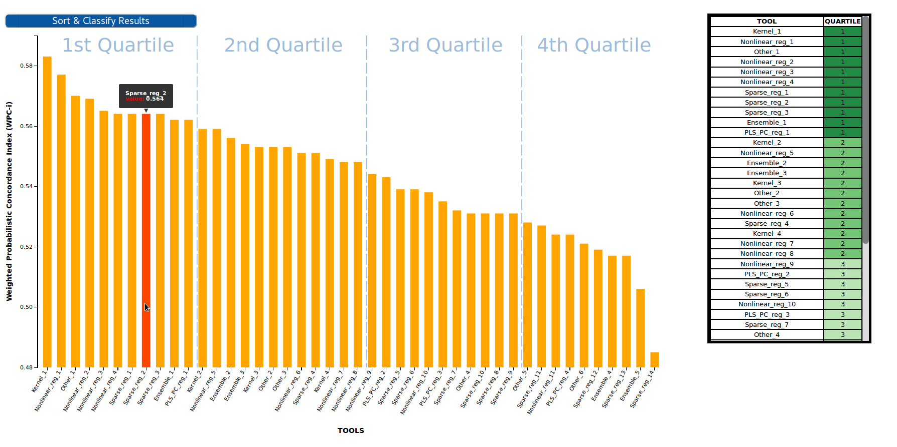

# Scientific Benchmarking Results Visualizer - Barplot

This [D3 graph](https://d3js.org/) is used to visualize the results of a benchmarking challenge that uses one single evaluation metric in the form of a Barplot. Challenge participants are shown in the X axis, while the value of their metric is shown in the Y axis.


## NPM Package
NPM Package `@inb/oeb-chart-barplot` published to: https://www.npmjs.com/package/@inb/oeb-chart-barplot

## Input
The visualizer uses as input the results of one challenge stored in the OpenEBench database in the format of the official [Benchmarking Data Model](https://github.com/inab/benchmarking-data-model).

Per default it consumes the [OpenEBench Sci-API](https://openebench.bsc.es/sciapi/) (deprecated).

It is also able to consume the new API [OpenEBench API Scientific](https://dev-openebench.bsc.es/api/scientific/). 
The API can be set by supplying the following attribute: `data-api-url="{{ API_URL }}"`

The API is used to access the database by using the following query:
```
getDatasets(datasetFilters:{challenge_id: $challenge_id, type:"assessment"}) {
                            _id
                            community_ids
                            datalink{
                                inline_data
                            }
                            depends_on{
                                tool_id
                                metrics_id
                            }
                        }
```

## Classification
As other [OpenEBench results visualizers](https://github.com/inab/OpenEBench_scientific_visualizer), this plot format results can be transfomed to tabular format by sorting the participants in descending/ascending order according to their metrics and applying a quartile classification over that lineal set of values. This classifcation splits the participants in four different groups/clusters depending on their performance. Clusters are separated in the plot with vertical lines and showed in the right table together with a green color-scale, which is easier to interpret for both experts and non-experts users.



## Live Demo
See a demo of how this visualizer works [here](https://inab.github.io/Scientific_Barplot/)

## How to use

The component can be imported in two way: As npm package (preferred), or via the build file from the git repository (see bottom).

### Use the npm package

`npm i @inb/oeb-chart-barplot`

In your frontend component:
`import { load_bars_visualization } from "@inb/oeb-chart-barplot";`

`<div data-id="OEBD004000000D" class="benchmarkingChart_bars" data-api-url="{{ API_URL }}"></div>`

You can then call the `load_bars_visualization()` function.

### Attributes that can be set on the _<div\>_ tag

-   data-id : the official OEB id of the benchmarking challenge you want to visualize
-   class: should always be *'benchmarkingChart_bars'*
-   data-api-url: Should always contain the full API URL e.g. https://openebench.bsc.es/api/scientific/graphql

Example:
`<div data-id="OEBD004000000D" class="benchmarkingChart_bars" data-api-url="{{ API_URL }}"></div>`


### Alternative way: Clone from repository

Requirements:

-npm
-http server

Clone the repo to your document root :
```
git clone https://github.com/inab/Scientific_Barplot.git
```
Set within the index.html 'benchmarkingChart_bars' div, the OEB id of the dataset (data-id) you want to visualize:
```html
<!DOCTYPE html>
<html lang="en">
    <head>
        <meta charset="UTF-8">
        <meta name="viewport" content="width=device-width, initial-scale=1.0">
        <meta http-equiv="X-UA-Compatible" content="ie=edge">
        <title>Scientific Benchmarking Barplot</title>
        
    </head>

    <body>
        <div style= "float:left" data-id="OEBD004000000D" class="benchmarkingChart_bars" data-api-url="{{ API_URL }}"></div>
    </body>
    
</html>
```

Install dependencies from package.json :
```
npm install 
```

Export node moodules :
```
export PATH="${PWD}/node_modules/.bin/:$PATH"
```
Compile with webpack and visualize sample results in your localhost :
```
./node_modules/.bin/webpack-cli src/app.js --output=build/build.js -d -w
